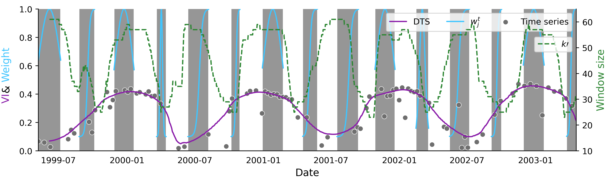

[](#mit-license)[](#python-3.6)[](#package-version)

[](https://lbesson.mit-license.org/)
[](https://www.python.org/downloads/release/python-360/)


Satellite signal interpolation and smoothing
---

### Dynamic temporal smoothing (DTS)

> Graesser, Jordan and Stanimirova, Radost and Friedl, Mark A. (2021) Reconstruction of satellite time series with a dynamic smoother. _EarthArXiv_.

```text
@article{graesser_stanimirova_friedl_2021,
  title={Reconstruction of satellite time series with a dynamic smoother},
  author={Graesser, Jordan and Stanimirova, Radost and Friedl, Mark A},
  year={2021},
  publisher={EarthArXiv}
}
```



### Installation

#### Installation on Linux

```commandline
pip install git+https://github.com/jgrss/satsmooth.git
```

or

```commandline
git clone https://github.com/jgrss/satsmooth.git
cd satsmooth/
pip install .
```

#### Installing on macOS
```commandline
# install libomp and llvm
brew install libomp llvm

# Ensure Clang is the c++ compiler
CC=/usr/local/opt/llvm/bin/clang++

# Ensure libomp is linked
export DYLD_LIBRARY_PATH=$(brew --prefix libomp):$DYLD_LIBRARY_PATH

# Clone and install satsmooth
git clone https://github.com/jgrss/satsmooth.git
cd satsmooth/
# Activate a venv before installing
source myvenv/bin/activate
(myvenv) python setup.py build && pip install . -r requirements.txt
```

#### Test the installation

```commandline
(myvenv) python -c "import satsmooth as sm;print(sm.__version__)"
```

### Imports

```python
import satsmooth as sm
from satsmooth.utils import prepare_x, nd_to_columns
import numpy as np
```

### Prepare the dates

```python
# Given an image shaped (time x rows x columns), setup the time
# `datetime` objects of length = time
#
# A single `datetime` object can be created by:
# from datetime import datetime
# dt = datetime.strptime('2010-03-01', '%Y-%m-%d')
dates = [datetime.datetime(), ..., datetime.datetime()]

# Set the date range
start = '2010-03-01'
end = '2011-11-01'

# Create the time object (x information)
# rule='D2' -> resample to every 2nd day before smoothing (improves performance over daily sampling)
# write_skip=10 -> write results to ~10-day intervals, restarting the 1st of each month
xinfo = prepare_x(dates, start, end, rule='D2', skip='N', write_skip=10)
```

Reshape the data

```python
# Load data into a numpy array shaped (time x rows x columns)
dims, nrows, ncols = y.shape

# Reshape from (time x rows x columns) to (samples x time)
y = nd_to_columns(y, dims, nrows, ncols)
```

Setup the interpolater

```python
# Instantiate a linear interpolater module for a sparse-->daily transform
interpolator = sm.LinterpMulti(xinfo.xd, xinfo.xd_smooth)

# Setup indices to return a sparse, regularly gridded output every ~10 days
indices = np.ascontiguousarray(xinfo.skip_idx + xinfo.start_idx, dtype='uint64')
```

Smooth the data

```python
# This function applies interpolation, outlier detection, regridding,
# and smoothing in one parallel iteration
y = interpolator.interpolate_smooth(np.ascontiguousarray(y, dtype='float64'),
                           fill_no_data=True,       # fill 'no data' by linear interpolation
                           no_data_value=0,
                           remove_outliers=True,    # search for outliers first
                           max_outlier_days1=120,   # linear
                           max_outlier_days2=120,   # polynomial
                           min_outlier_values=7,
                           outlier_iters=1,
                           dev_thresh1=0.2,
                           dev_thresh2=0.2,
                           return_indexed=True,     # return the ~weekly data rather than daily
                           indices=indices,         # the indices to return
                           max_window=61,
                           min_window=21,
                           mid_g=0.5,
                           r_g=-10.0,
                           mid_k=0.5,
                           r_k=-10.0,
                           mid_t=0.5,
                           r_t=15.0,
                           sigma_color=0.1,
                           n_iters=2,
                           n_jobs=8)
```
